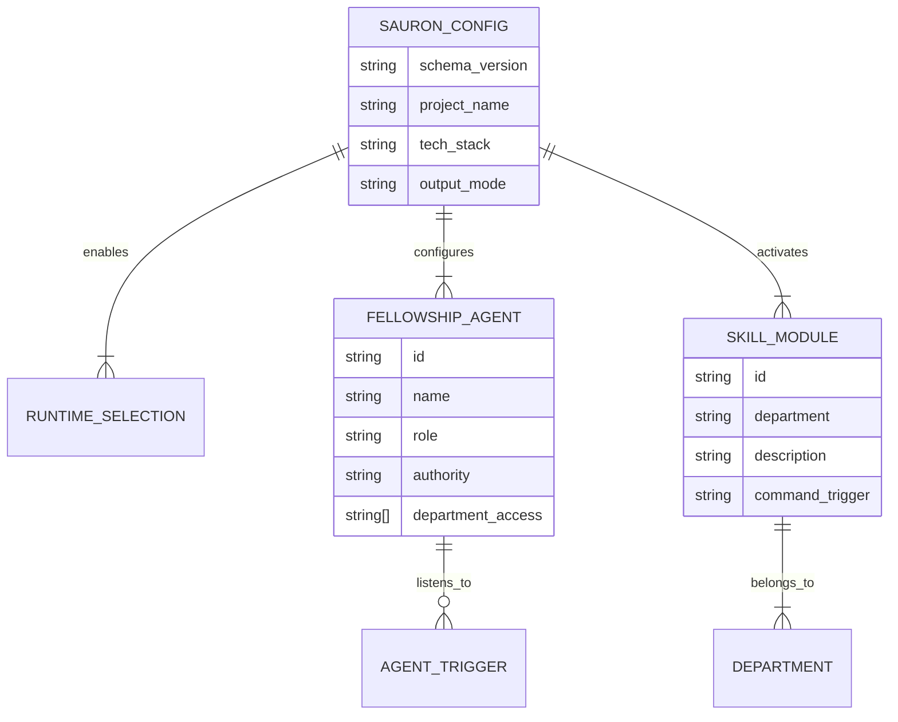

# SCHEMA: Configuration and State Schemas: Sauron AI

> **Purpose:** Defines the declarative schemas for `sauron.config.yaml`, the Fellowship sub-agent specifications, and runtime output formats.

_Last updated: 2026-09-19_

---

## 1. Schema Overview

Sauron maintains zero external database dependencies. All state, configuration, and agent definitions are file-backed and version-controlled using YAML and JSON schemas.



---

## 2. Master Configuration Schema (`sauron.config.yaml`)

```yaml
# yaml-language-server: $schema=./schema/sauron.schema.json
version: "1.0.0"
project:
  name: "my-app"
  description: "Target application description"
  language: "typescript" # typescript | python | rust | go | multi
  framework: "nextjs" # optional framework hint

# 17 Target Runtimes (toggle per workspace)
runtimes:
  claude: true
  cursor: true
  windsurf: true
  copilot: true
  cline: true
  trae: true
  zed: true
  codex: true
  gemini: true
  hermes: true
  kimi: true
  kiro: true
  openclaude: true
  opencode: true
  pi: true
  qwen: true
  adal: true
  codebuddy: true

# The 9 Fellowship Sub-Agents
fellowship:
  gandalf:
    enabled: true
    role: "Master Planner and Strategy Guide"
    alias: ["planner", "lead"]
  aragorn:
    enabled: true
    role: "Principal System Architect"
    alias: ["architect", "design"]
  legolas:
    enabled: true
    role: "Precision Linter and Syntax Bug Hunter"
    alias: ["linter", "syntax"]
  gimli:
    enabled: true
    role: "Refactorer and Dead Code Slasher"
    alias: ["refactor", "cleanup"]
  boromir:
    enabled: true
    role: "Security Auditor and Shield"
    alias: ["security", "audit"]
  frodo:
    enabled: true
    role: "Core Task Executor"
    alias: ["executor", "coder"]
  samwise:
    enabled: true
    role: "Git Commits and State Keeper"
    alias: ["commits", "git"]
  merry:
    enabled: true
    role: "QA and TDD Specialist"
    alias: ["tester", "tdd"]
  pippin:
    enabled: true
    role: "Edge Case and Chaos Prober"
    alias: ["fuzzer", "chaos"]

# Engineering Department Skills
departments:
  architecture:
    - plan-feature
    - define-architecture
    - schema-design
  qa_testing:
    - tdd-runner
    - coverage-audit
    - edge-fuzzer
  security:
    - security-audit
    - secrets-scan
    - owasp-check
  devsecops:
    - conventional-commit
    - ci-generator
  documentation:
    - readme-generator
    - api-doc-gen

settings:
  backup_existing: true
  dry_run: false
  anti_vibe_coding_strict_mode: true
```

---

## 3. Fellowship Sub-Agent Specification Schema

Each agent definition in `core/fellowship/*.md` conforms to the following frontmatter and markdown structure:

```yaml
---
id: gandalf
name: Mithrandir
title: Master Planner and Strategy Guide
department: architecture
invocation:
  slash_command: /gandalf
  tag: "@gandalf"
  intent_keywords: ["plan", "breakdown", "roadmap", "foundation", "prd"]
authority:
  can_modify: ["PRD.md", "TASKS.md", "ROADMAP.md"]
  must_not_modify: ["src/*", "package.json", "licenses/*"]
anti_patterns_prevented: ["AP-1", "AP-2", "AP-26", "AP-28"]
---
```

---

## 4. Skill Specification Schema

Each skill in `core/skills/*/*.md` adheres to the standard intent model:

```yaml
---
id: tdd-runner
name: TDD Runner and Assertion Gate
department: qa_testing
owner_agent: merry
trigger_command: /test-gate
version: 1.0.0
---
```

---

## 5. Conflict and Backup Metadata Schema (`.sauron/manifest.json`)

Tracks files generated by Sauron and manages restore points:

```json
{
  "installed_at": "2026-09-19T07:00:00.000Z",
  "version": "1.0.0",
  "managed_files": [
    {
      "path": "CLAUDE.md",
      "runtime": "claude",
      "backup_path": ".sauron/backups/CLAUDE.md.20260919.bak",
      "checksum": "sha256:abcd..."
    },
    {
      "path": ".cursorrules",
      "runtime": "cursor",
      "backup_path": null,
      "checksum": "sha256:1234..."
    }
  ]
}
```
