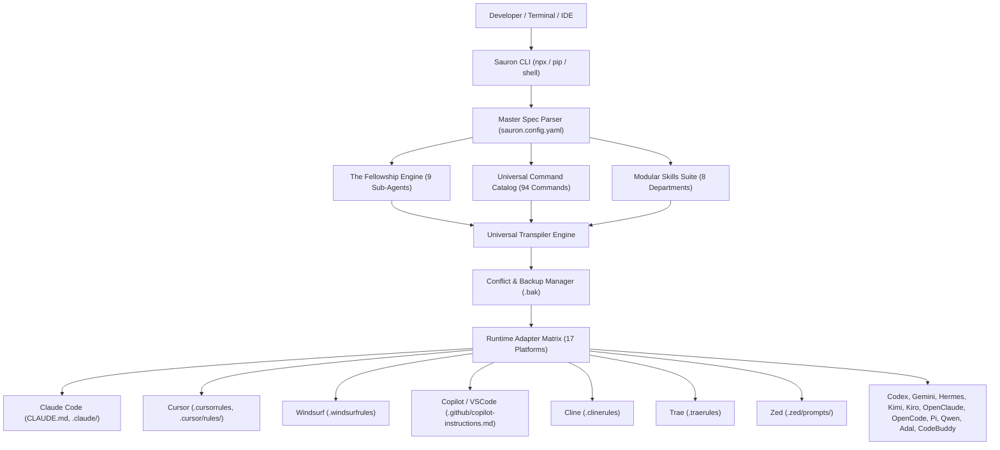

# ARCHITECTURE: System Architecture: Sauron AI

> **Purpose:** Describes the technical architecture, runtime adapter matrix, Fellowship orchestration layer, directory boundaries, and sandboxing model for `Sauron AI`.

_Last updated: 2026-09-20_

---

## 1. System Overview and Foundational Architecture

Sauron AI operates as a local-first, deterministic transpile-and-orchestration engine for AI coding agents. It compiles a declarative Master Specification (`sauron.config.yaml`) into runtime-native instructions across 17 AI coding agent environments in under 50 milliseconds.



---

## 2. Layered Architecture and Conventions

1. **Presentation & Invocation Layer:**
   - Command-line interfaces: `npx sauron [init|sync|diff|test]`, `pip install sauron-ai`, and `install.sh` / `install.ps1`.
   - Omnichannel bindings: 94 universal slash commands (`commands/`), direct persona tagging (`@gandalf`, `@aragorn`), and intent-based routing.
2. **Core Fellowship Layer:**
   - 9 specialized sub-agent definitions with strict role and authority boundaries:
     - `gandalf`: Master Planner and Strategic Task Decomposer (`context/PRD.md`, `context/TASKS.md`).
     - `aragorn`: Principal Architect, Layer Boundaries, and Schema Guardian (`context/ARCHITECTURE.md`, `context/SCHEMA.md`).
     - `legolas`: AST Linter, Syntax Inspector, and Import Hygiene Guardian.
     - `gimli`: AST Refactorer, Dead Code Slasher, and Complexity Reducer.
     - `boromir`: Security Shield, Threat Modeler, and Secret Leak Detector.
     - `frodo`: Core Task Ringbearer and Focused Atomic Execution Engine.
     - `samwise`: Git Conventional Commits, Worktree Manager, and State Auditor.
     - `merry`: Test-Driven Development Specialist and Test Coverage Auditor.
     - `pippin`: Chaos Prober, Boundary Edge-Case Hunter, and Fuzzer.
3. **Department Skill Layer (`skills/`):**
   - Autonomous, self-contained capability suites organized into 8 functional departments:
     - `skills/architecture/`: API design, ADRs, clean architecture, feature flags, function design, module organization, naming conventions.
     - `skills/backend/`: Backend development, caching principles, database principles, python principles, websocket management.
     - `skills/database/`: Database migration, postgres query planning, zero-downtime partitioning.
     - `skills/devops/`: CI/CD deployment, docker principles, git bash, powershell, shell scripting, windows cmd, git reconciler.
     - `skills/frontend/`: HTML/CSS principles, javascript principles, nextjs principles, react principles, tailwind principles, typescript standards, mobile react native.
     - `skills/quality/`: Testing principles, write-a-test, design principles, tech debt principles, flaky test resolution, pact contract testing, playwright visual fixtures, evaluation harness.
     - `skills/security/`: Agent guard, incident response, OWASP ASVS verification, SAST code scanner, SBOM generation, zero-trust identity.
     - `skills/workflow/`: Engineering loop, career search, enterprise business, prompt engineering, research & productivity.
4. **Adapter and Transpiler Layer (`adapters/`):**
   - Transpiles unified definitions into target file formats using deterministic templates and regex-safe parsing.
5. **Safety and Storage Layer (`.sauron/`):**
   - Non-destructive backup utility generating timestamped `.bak` files.
   - Manifest state tracker (`.sauron/manifest.json`) recording checksums and file origins.

---

## 3. Directory and Domain Structure

```text
sauron/
├── .github/                 # GitHub workflows, issue templates, and copilot instructions
├── .husky/                  # Git hooks for pre-commit linting and test verification
├── .sauron/                 # Workspace metadata and safe backup store
│   ├── backups/             # Timestamped rollback copies (*.bak)
│   └── manifest.json        # State manifest tracking generated file hashes
├── adapters/                # 17 runtime transpilation adapters
│   ├── types.ts             # Transpiler contracts and runtime options interface
│   ├── conflict-manager.ts  # Non-destructive file writer with automated backups
│   ├── claude.ts            # Claude Code adapter (CLAUDE.md & slash commands)
│   ├── cursor.ts            # Cursor adapter (.cursorrules & rules/*.mdc)
│   ├── windsurf.ts          # Windsurf adapter (.windsurfrules)
│   ├── copilot.ts           # GitHub Copilot & VS Code adapter
│   ├── cline.ts             # Cline adapter (.clinerules)
│   ├── trae.ts              # Trae adapter (.traerules)
│   ├── zed.ts               # Zed editor adapter (.zed/prompts/ & settings)
│   └── generic.ts           # Adapters for Codex, Gemini, Hermes, Kimi, Kiro, OpenClaude, OpenCode, Pi, Qwen, Adal, CodeBuddy
├── bin/                     # CLI executable entry points
│   └── sauron.mjs           # Node.js CLI binary
├── commands/                # 94 universal markdown slash command definitions
│   ├── plan.md              # Feature planning command (/plan)
│   ├── architect.md         # System architecture command (/architect)
│   ├── refactor.md          # AST refactoring command (/refactor)
│   ├── security.md          # Security audit command (/security)
│   ├── tdd.md               # Test-driven development command (/tdd)
│   └── commit.md            # Git conventional commit command (/commit)
├── config/                  # Master workspace configuration schemas and defaults
│   └── sauron.config.yaml   # Canonical user configuration for 17 runtimes & Fellowship
├── context/                 # Sauron project foundation specifications
│   ├── ARCHITECTURE.md      # Technical architecture and topology specification
│   ├── PRD.md               # Product Requirements Document and vision
├── core/                    # Core governance agents and Fellowship definitions
│   ├── fellowship/          # 9 Fellowship agent profiles (gandalf, aragorn, frodo, etc.)
│   ├── agents/              # 72 specialized role definitions (architect, executor, linter, etc.)
│   └── skills/              # Base department execution skills
├── licenses/                # Multi-license directory (MIT, Apache-2.0, Unlicense)
├── references/              # Normative reference materials and credit-killing patterns
│   └── anti-patterns.md     # 60 credit-killing anti-patterns reference
├── rules/                   # Universal engineering rules enforced across all agents
│   ├── common/              # Code style, general rules, safety boundaries, token efficiency
│   ├── engineering/         # Architecture boundaries, defensive programming, testing pyramid
│   ├── languages/           # TypeScript strict, Python production, Go concurrency, Rust safety
│   └── security/            # OWASP defensive shield, supply chain integrity
├── schema/                  # JSON Schemas validating YAML configurations
│   └── sauron.schema.json   # JSON Schema definition for sauron.config.yaml
├── scripts/                 # Maintenance, transpilation, and link-audit automation scripts
├── skills/                  # Production modular skill suite (44+ core, 500+ ecosystem)
│   ├── architecture/        # 7 Tier-5 architectural skills (api-design, clean-arch, etc.)
│   ├── backend/             # Backend patterns, caching, database principles, websockets
│   ├── database/            # Migrations, postgres query optimization, table partitioning
│   ├── devops/              # CI/CD, docker, shell scripting, powershell, git reconciler
│   ├── frontend/            # HTML/CSS, JavaScript, Next.js, React, Tailwind, TypeScript, Mobile
│   ├── quality/             # Testing principles, write-a-test, contract testing, eval harness
│   ├── security/            # Agent guard, incident response, OWASP ASVS, SAST, SBOM, Zero Trust
│   └── workflow/            # Autonomous dev, engineering loop, prompt engineering, productivity
├── tests/                   # Automated test suite (conflict manager, transpiler, sandboxing)
├── .gitignore               # Ignored dependencies, build outputs, and local secrets
├── AGENTS.md                # Universal root agent harness instruction entrypoint
├── CLAUDE.md                # Generated Claude Code configuration
├── GEMINI.md                # Generated Gemini CLI configuration
├── package.json             # Node package manifest
├── pyproject.toml           # Python package manifest
└── tsconfig.json            # Strict TypeScript configuration
```

---

## 4. Runtime Adapter Matrix (17 Platforms)

| #   | Runtime / Platform            | Generated File / Path                 | Target Format                |
| :-- | :---------------------------- | :------------------------------------ | :--------------------------- |
| 1   | **Claude Code**               | `CLAUDE.md`, `.claude/commands/`      | Markdown and Slash Commands  |
| 2   | **Cursor**                    | `.cursorrules`, `.cursor/rules/*.mdc` | Markdown and Frontmatter MDC |
| 3   | **Windsurf**                  | `.windsurfrules`                      | Markdown Rules               |
| 4   | **GitHub Copilot and VSCode** | `.github/copilot-instructions.md`     | Markdown Instructions        |
| 5   | **Cline**                     | `.clinerules`                         | Markdown Rules               |
| 6   | **Trae**                      | `.traerules`, `.trae/`                | Markdown Rules               |
| 7   | **Zed**                       | `.zed/prompts/`, `.zed/settings.json` | JSON and Prompt Templates    |
| 8   | **Codex**                     | `.codex/instructions.md`              | Markdown Prompt              |
| 9   | **Gemini**                    | `GEMINI.md`                           | Markdown Context             |
| 10  | **Hermes**                    | `.hermesrules`                        | Markdown Rules               |
| 11  | **Kimi**                      | `.kimi/prompt.md`                     | Markdown System Prompt       |
| 12  | **Kiro**                      | `.kirorules`                          | Markdown Rules               |
| 13  | **OpenClaude**                | `.openclaude/config.json`             | JSON and Markdown            |
| 14  | **OpenCode**                  | `.opencode/instructions.md`           | Markdown Instructions        |
| 15  | **Pi**                        | `.pirules`                            | Plaintext and Markdown       |
| 16  | **Qwen**                      | `.qwen/system.md`                     | Markdown System Prompt       |
| 17  | **Adal and CodeBuddy**        | `.adalrules`, `.codebuddy_rules.md`   | Markdown Rules               |

---

## 5. Security and Sandboxing Architecture

Sauron enforces defense-in-depth through concrete runtime controls:

1. **Local Execution Invariant:** Zero remote telemetry, zero outbound prompt sniffing, and zero network calls during code transpilation. All templates render locally from static files.
2. **Deterministic File Boundaries:** Write operations target only designated repository paths. System files, hidden directories outside `.sauron`, and parent directories are protected by boundary path checks.
3. **Destructive Overwrite Defense:** The `ConflictManager` hashes target files, checks for differences, and automatically creates backup snapshots in `.sauron/backups/` before any write.
4. **Sandboxing Isolation:** Full support for running within Docker containers and development containers (`.devcontainer/`), ensuring that untrusted execution environments cannot access host network interfaces or unauthorized volumes.
