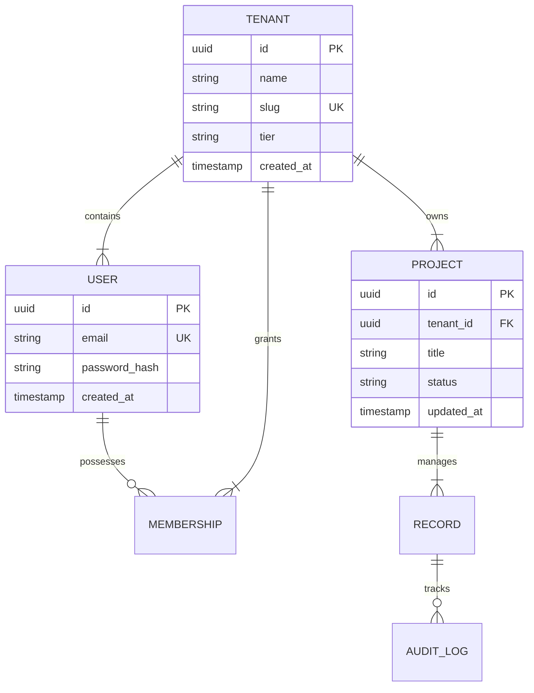

# SCHEMA — Data Contracts & Persistence Schema

> **Purpose:** Document database entity definitions, relationship topology, runtime validation contracts, migration lifecycle policies, and branded identifiers so AI agents and developers execute queries and mutations safely without hallucinating schema details. Tier-3 template — fill it in for your project.

_Last updated: [DATE]_

---

## 1. Datastore Architecture & Strategy

[PLACEHOLDER: Overview of primary persistent datastores, caching layers, and search indexes.]

- **Primary Datastore:** PostgreSQL 16+ (ACID compliant, relational integrity).
- **In-Memory Cache:** Redis 7+ (Session state, distributed rate limiting, cache-aside data).
- **Blob / File Storage:** S3-compatible object store (Presigned upload workflows, private buckets).

---

## 2. Entity-Relationship Diagram (ERD)

[PLACEHOLDER: Provide a Mermaid ER diagram detailing all primary business entities and cardinalities.]



---

## 3. Physical Table Specifications & DDL

[PLACEHOLDER: Detailed table definitions, column types, nullability, defaults, foreign keys, and indexes.]

### Table: `users`

Primary identity credentials and global account attributes.

| Column        | Data Type      | Nullable | Default             | Constraints / Indexing          | Business Purpose                                            |
| :------------ | :------------- | :------- | :------------------ | :------------------------------ | :---------------------------------------------------------- |
| `id`          | `UUID`         | No       | `gen_random_uuid()` | Primary Key                     | Universally unique user identifier.                         |
| `email`       | `VARCHAR(255)` | No       | None                | Unique Index (Case-Insensitive) | Account login identifier and primary communication channel. |
| `is_verified` | `BOOLEAN`      | No       | `false`             | None                            | Flag confirming email ownership verification.               |
| `created_at`  | `TIMESTAMPTZ`  | No       | `clock_timestamp()` | Index (Descending)              | Audit timestamp of initial user registration.               |
| `updated_at`  | `TIMESTAMPTZ`  | No       | `clock_timestamp()` | None                            | Timestamp of most recent attribute modification.            |

### Table: `projects`

Tenant-isolated workspace projects.

| Column      | Data Type      | Nullable | Default             | Constraints / Indexing                 | Business Purpose                                 |
| :---------- | :------------- | :------- | :------------------ | :------------------------------------- | :----------------------------------------------- |
| `id`        | `UUID`         | No       | `gen_random_uuid()` | Primary Key                            | Unique project identifier.                       |
| `tenant_id` | `UUID`         | No       | None                | FK -> `tenants(id)` ON DELETE RESTRICT | Strict tenancy boundary key.                     |
| `name`      | `VARCHAR(128)` | No       | None                | Composite Unique (`tenant_id`, `name`) | Human-readable project name unique per tenant.   |
| `status`    | `VARCHAR(32)`  | No       | `'draft'`           | Index (`status`)                       | Operational lifecycle status enum.               |
| `metadata`  | `JSONB`        | No       | `'{}'::jsonb`       | GIN Index (`metadata jsonb_path_ops`)  | Flexible, schema-validated arbitrary attributes. |

---

## 4. Runtime Validation Schemas & Branded Types

All data crossing network, disk, or user boundaries must be parsed and strictly typed using runtime validation libraries (e.g. Zod).

```typescript
import { z } from "zod";

// 1. Branded Primary Key Identifiers
export const UserIdSchema = z.string().uuid().brand<"UserId">();
export type UserId = z.infer<typeof UserIdSchema>;

export const ProjectIdSchema = z.string().uuid().brand<"ProjectId">();
export type ProjectId = z.infer<typeof ProjectIdSchema>;

// 2. Strict Entity Parsing Schemas
export const UserEntitySchema = z
  .object({
    id: UserIdSchema,
    email: z.string().email().max(255).toLowerCase().trim(),
    isVerified: z.boolean(),
    createdAt: z.date(),
    updatedAt: z.date(),
  })
  .strict();
export type UserEntity = z.infer<typeof UserEntitySchema>;

// 3. Mutation Payloads (DTOs)
export const CreateProjectDtoSchema = z
  .object({
    name: z.string().min(3).max(128).trim(),
    metadata: z.record(z.unknown()).default({}),
  })
  .strict();
export type CreateProjectDto = z.infer<typeof CreateProjectDtoSchema>;
```

---

## 5. Schema Migration & Zero-Downtime Expand-Contract Rules

Non-negotiable database migration policies to guarantee zero downtime and prevent table lock contention.

1. **Destructive Alteration Ban:** Direct column removals (`ALTER TABLE DROP COLUMN`) and in-place column type mutations are strictly prohibited in production.
2. **Four-Phase Expand/Contract Protocol:**
   - **Phase 1 (Expand):** Add the new column as nullable or with a non-blocking default. Deploy application code that writes to both old and new columns.
   - **Phase 2 (Backfill):** Backfill existing historical records in throttled batches (e.g. 1,000 rows with 50ms pause) to avoid long-lived row locks.
   - **Phase 3 (Contract Application):** Update application services to read exclusively from the new column.
   - **Phase 4 (Contract Database):** Mark the old column deprecated, stop dual writes, and drop the legacy column in a subsequent release.
3. **Non-Blocking Indexing:** Always create production indexes concurrently (`CREATE INDEX CONCURRENTLY`) to eliminate table-level write locks.
