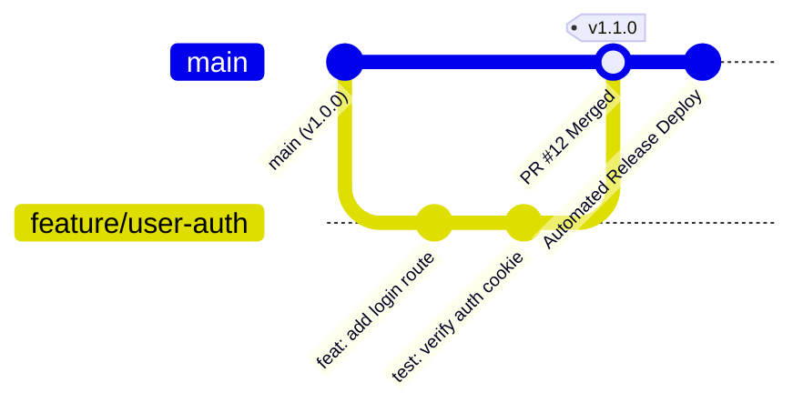
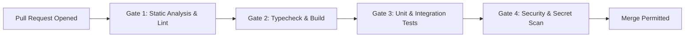

# DEPLOYMENT — CI/CD & Release Workflows

> **Purpose:** Canonical specification for continuous integration pipelines, automated deployment stages, semantic release tagging, canary deployments, and rollback runbooks. Tier-3 template — customize for your project.

_Last updated: [DATE]_

---

## 1. Release Lifecycle & Git Branching Model

Enforce Trunk-Based Development with ephemeral feature branches and automated releases.

1. **Short-Lived Branches:** Feature branches must live less than 48 hours and merge into `main` via pull requests with passing CI.
2. **Conventional Commits:** Commit messages must follow the Conventional Commits specification (`feat:`, `fix:`, `refactor:`, `test:`, `chore:`).
3. **Semantic Versioning:** Release tags follow `vMAJOR.MINOR.PATCH` derived automatically via semantic-release based on merged commit types.

---

## 2. Continuous Integration Pipeline (CI Gates)

Every pull request must pass all four automated gates before merge approval is granted:

- **Gate 1 (Lint):** Biome or ESLint checks with zero warnings permitted (`--max-warnings 0`).
- **Gate 2 (Typecheck):** Strict compilation (`tsc --noEmit`) verifying type integrity across all packages.
- **Gate 3 (Tests):** Unit and integration test suites executed with code coverage assertions.
- **Gate 4 (Security):** Dependency vulnerability scan (`npm audit --audit-level=high`) and secret leak detection.

---

## 3. Deployment Topology & Rollback Protocols

- **Zero-Downtime Deployment:** Utilize rolling updates or blue-green deployments where new containers must pass health checks before receiving production ingress traffic.
- **Canary Rollouts:** Direct 5% of production traffic to newly deployed releases for 10 minutes, monitoring error rates (HTTP 5xx) and P95 latency. Automatically rollback if error rates exceed 0.5%.
- **Emergency Rollback Runbook:**
  1. Trigger automated rollback via CLI or deployment portal: `sauron rollback --env=production`.
  2. The traffic router immediately flips ingress to the previous stable release tag.
  3. Database expand-contract migrations must guarantee that previous application code runs safely against the current database schema without schema reversal.
