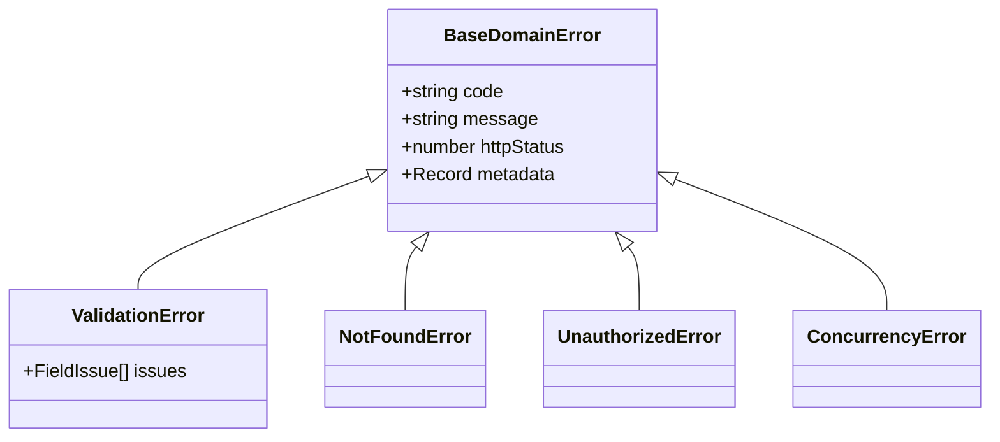

# ERROR-HANDLING — Error Handling & Resilience Architecture

> **Purpose:** Canonical standards for error categorization, exception hierarchies, sanitized HTTP error envelopes, retry policies, and circuit breakers. Tier-3 template — customize for your project.

_Last updated: [DATE]_

---

## 1. Exception Hierarchy & Error Categorization

All errors must inherit from a foundational domain exception class and carry explicit machine-readable codes.



1. **Domain Errors:** Predictable business failures (e.g. `INSUFFICIENT_FUNDS`, `PLAN_LIMIT_REACHED`). Handled gracefully with deterministic HTTP 4xx responses.
2. **Infrastructure Errors:** Third-party timeouts, transient database disconnections, or filesystem failures. Handled with retries or circuit breakers.
3. **Internal Panics / Bugs:** Uncaught exceptions or assertion failures. Caught by perimeter boundary middlewares, logged with full stack traces, and mapped to sanitized HTTP 500 responses.

---

## 2. Sanitized Boundary Error Envelope

Never expose internal database queries, column names, or stack traces to untrusted clients.

```typescript
// Deterministic error response returned to client
export interface ApiErrorEnvelope {
  readonly success: false;
  readonly error: {
    readonly code: string; // e.g. "RESOURCE_NOT_FOUND"
    readonly message: string; // Human-readable sanitized explanation
    readonly requestId: string; // Trace identifier linking to internal logs
  };
}
```

---

## 3. Retry Policies & Circuit Breakers

- **Idempotent Operations Only:** Retries are permitted only on idempotent requests (`GET`, `PUT`, `DELETE`) or `POST` requests bearing an `Idempotency-Key`.
- **Exponential Backoff with Jitter:** Calculate retry delays using exponential backoff combined with randomized full jitter to prevent thundering herd spikes on recovered services:
  ```typescript
  const delay =
    Math.min(maxDelay, baseDelay * Math.pow(2, attempt)) * Math.random();
  ```
- **Circuit Breaker Thresholds:** Open the circuit breaker if the failure rate exceeds 50% over a 10-second sliding window. Provide fallback cached responses when available.
