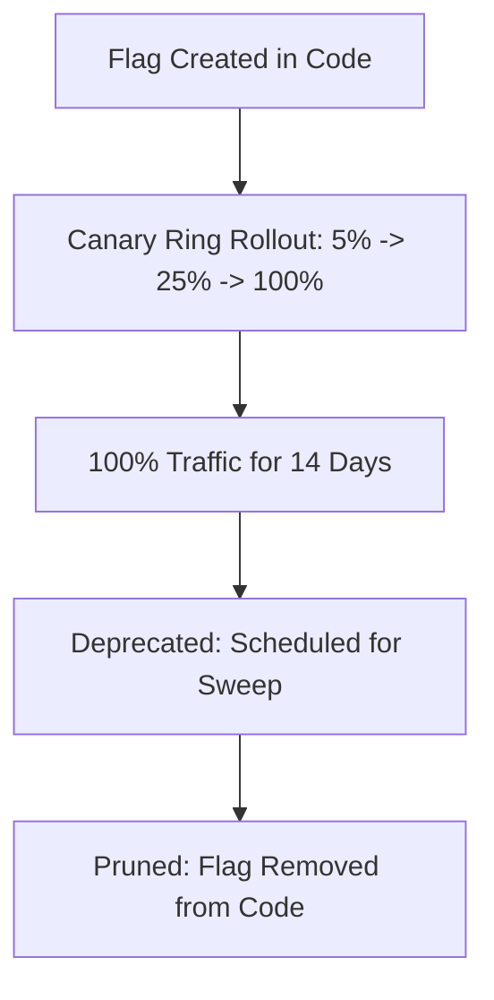

# FEATURE-FLAGS — Feature Flag & Progressive Delivery Strategy

> **Purpose:** Canonical standards for feature flag naming, in-memory evaluation, canary percentage rollouts, circuit-breaker kill switches, and automated flag retirement schedules. Tier-3 template — customize for your project.

_Last updated: [DATE]_

---

## 1. Feature Flag Taxonomy & Lifecycles

All feature toggles must be categorized into one of three explicit tiers to prevent permanent technical debt accumulation.



1. **Release Flags (Short-Lived):** Temporary flags gating new feature deployments. Maximum lifespan: 30 days. Must be swept and deleted once rolled out to 100% of users.
2. **Operational / Kill Switches (Long-Lived):** Emergency circuit breakers controlling high-risk integrations (e.g. disabling a third-party payment gateway during an outage).
3. **Permission / Tier Flags (Permanent):** Entitlement gates controlling access to enterprise features based on workspace subscription tier.

---

## 2. Naming Conventions & Code Evaluation

- **Naming Syntax:** Flags must follow lowercase kebab-case with domain prefix: `[domain].[feature-name].[variant]` (e.g. `billing.stripe-elements.v2`, `auth.passkeys.enabled`).
- **In-Memory Evaluation:** Flag evaluation must execute in-memory with sub-millisecond latency. Never make synchronous network calls during the hot request path.
- **Fail-Safe Fallbacks:** Every flag evaluation must specify an explicit, safe default value in case the configuration store is unreachable.

```typescript
// Example: Safe OpenFeature evaluation pattern
const isPasskeysEnabled = await featureClient.getBooleanValue(
  "auth.passkeys.enabled",
  false, // Safe fallback: disabled by default
  { targetingKey: user.id, tenantId: user.tenantId },
);
```

---

## 3. Flag Retirement & Sweep Policy

- **Retirement Alarm:** Automated CI scripts must scan for feature flags older than 45 days and generate refactoring tasks in `context/TASKS.md`.
- **Code Cleanliness:** When removing a feature flag, delete all dead conditional branches, obsolete tests, and configuration entries atomically in a single pull request.
