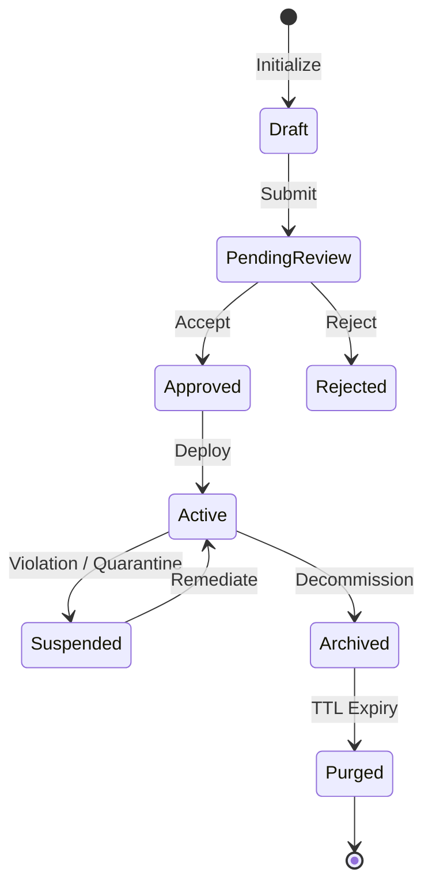

# GLOSSARY — Domain Vocabulary & Ubiquitous Language

> **Purpose:** Canonical domain vocabulary, ubiquitous language definitions, and entity naming rules. Eliminates semantic ambiguity, term drift, and conflicting vocabulary across AI coding agents, developers, and product stakeholders. Tier-3 template — customize for your project.

_Last updated: [DATE]_

---

## 1. Domain Entities & Nouns

Canonical naming definitions for business objects and core system entities. Every entity must have exactly one approved term. Synonyms and deprecated aliases are prohibited in code, comments, and schemas.

| Canonical Term              | Deprecated Aliases               | Scope / Domain                  | Definition & Business Invariant                                                                                    |
| :-------------------------- | :------------------------------- | :------------------------------ | :----------------------------------------------------------------------------------------------------------------- |
| `[PLACEHOLDER: EntityName]` | `[PLACEHOLDER: ForbiddenAlias]`  | `[PLACEHOLDER: auth / billing]` | `[PLACEHOLDER: Definitive explanation of what this entity represents, its uniqueness constraints, and lifecycle.]` |
| `User`                      | `Account`, `Client`, `Customer`  | Identity & Auth                 | An authenticated individual identity holding credentials and global workspace permissions.                         |
| `Workspace`                 | `Tenant`, `Organization`, `Team` | Tenancy                         | An isolated tenancy boundary containing projects, members, billing tiers, and configurations.                      |
| `Membership`                | `UserRole`, `MemberJoin`         | Access Control                  | The associative entity linking a `User` to a `Workspace` with designated RBAC permissions.                         |

---

## 2. Business Actions & Verbs

Deterministic naming standards for state-changing operations, event triggers, and business workflows.

| Canonical Verb | Prohibited Synonyms           | Applicable Entities      | Semantic Contract                                                                                                |
| :------------- | :---------------------------- | :----------------------- | :--------------------------------------------------------------------------------------------------------------- |
| `Provision`    | `Create`, `Generate`, `Setup` | Workspaces, Environments | Allocates infrastructure, seeds initial database records, and binds default permissions.                         |
| `Revoke`       | `Cancel`, `Delete`, `Remove`  | Access Tokens, Invites   | Invalidates credentials immediately and logs an immutable audit event without destroying historical records.     |
| `Archive`      | `SoftDelete`, `Trash`         | Projects, Artifacts      | Marks an active resource read-only and hides it from operational queries while preserving foreign-key integrity. |
| `Purge`        | `HardDelete`, `Nuke`          | Archived Entities        | Permanently removes records and cascades deletion across cold storage following statutory retention periods.     |

---

## 3. System States & Lifecycle Enums

Explicit lifecycle state mappings to eliminate divergent status representations across database columns, API responses, and UI badges.

### State Enum Definitions

- **`Draft`**: Mutable in-memory or persisted entity unready for production workflows.
- **`PendingReview`**: Locked record undergoing automated checks or human approval gates.
- **`Approved`**: Verified contract ready for deployment or execution.
- **`Active`**: Live, operational state receiving production traffic or queries.
- **`Suspended`**: Temporarily disabled due to policy violation, rate limits, or billing delinquency.
- **`Archived`**: Soft-decommissioned entity retained exclusively for compliance and historical audit.
- **`Purged`**: Tombstoned and permanently eliminated from primary persistence engines.

---

## 4. Banned Terminology & False Cognates

Terms that carry conflicting definitions across engineering disciplines or encourage ambiguous implementation.

| Prohibited Term | Why It Is Prohibited                                                             | Replacement / Mandated Alternative                                                 |
| :-------------- | :------------------------------------------------------------------------------- | :--------------------------------------------------------------------------------- |
| `Data`          | Vague noise word with zero semantic specificity (AP-1).                          | Specify exact payload (`UserProfile`, `BillingInvoice`, `AuditLog`).               |
| `Manager`       | Encourages god-object anti-patterns and bloated service classes.                 | Use single-responsibility roles (`Coordinator`, `Router`, `Client`, `Repository`). |
| `Handle`        | Ambiguous whether it parses, mutates, or catches failures.                       | Use explicit intent (`ProcessPayment`, `VerifySignature`, `RouteWebhook`).         |
| `Flag`          | Ambiguous whether it represents a boolean setting, feature toggle, or error bit. | Specify scope (`FeatureToggle`, `IsActive`, `HasVerifiedEmail`).                   |

---

## 5. Architectural & Cross-Boundary Nouns

Universal naming conventions across client-server boundaries, messaging queues, and database records.

- **`DTO` (Data Transfer Object)**: Strictly serializable, un-behavioral contract sent across network boundaries.
- **`Entity`**: Pure domain business model possessing persistent identity and encapsulating business invariants.
- **`ValueObject`**: Immutable domain attribute possessing zero independent identity, equated purely by value.
- **`Event`**: Immutable notification that a specific domain state transition occurred in the past.
- **`Command`**: Explicit imperative request directed to a single handler instructing a mutation.
