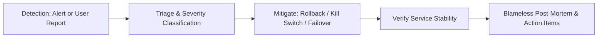

# INCIDENTS — Incident Response & Triage Protocols

> **Purpose:** Canonical runbook for severity level classification, incident commander roles, automated communication templates, post-mortem standards, and root cause remediation. Tier-3 template — customize for your project.

_Last updated: [DATE]_

---

## 1. Incident Severity Matrix

| Severity Tier          | Impact Scope                                                     | Pager SLA    | Escalation & Response Protocol                                            |
| :--------------------- | :--------------------------------------------------------------- | :----------- | :------------------------------------------------------------------------ |
| **`SEV-1 (Critical)`** | Complete service outage, data corruption, or security breach.    | `< 5 mins`   | Immediate war room; page all on-call engineers; updates every 15 minutes. |
| **`SEV-2 (Major)`**    | Core feature degraded for > 20% of users (e.g. checkout broken). | `< 15 mins`  | Page primary on-call; engineering lead engaged; updates every 30 minutes. |
| **`SEV-3 (Moderate)`** | Non-critical feature broken; workaround available.               | `< 1 hour`   | Business hours response; ticket logged in backlog.                        |
| **`SEV-4 (Minor)`**    | Minor visual glitch or cosmetic defect.                          | `< 24 hours` | Prioritized during standard sprint planning.                              |

---

## 2. Incident Response Workflow



1. **Step 1: First Mitigate, Then Diagnose:** When production is degraded, the priority is restoring customer service immediately (e.g. rollback recent deploy, flip circuit-breaker flag, restart pods) before investigating root causes.
2. **Step 2: Incident Commander Role:** The first on-call engineer to respond assumes Incident Commander (IC) authority, coordinating diagnostics, delegating remediation tasks, and managing stakeholder communication.
3. **Step 3: Communication Channel:** Open a dedicated temporary communication channel (`#inc-[date]-[service]`) for all diagnostics and updates.

---

## 3. Blameless Post-Mortem Template

Every SEV-1 and SEV-2 incident requires a published blameless post-mortem within 48 hours:

```markdown
# Incident Post-Mortem: [Brief Title] (Date: YYYY-MM-DD)

## Summary

- **Duration:** [HH:MM]
- **Impacted Users:** [Percentage or count]
- **Incident Commander:** [Name]

## Timeline (UTC)

- `14:02` - Deployment v1.4.2 released to production.
- `14:05` - P99 latency alert triggered on payment endpoint.
- `14:08` - Incident Commander declared SEV-1.
- `14:12` - Rollback to v1.4.1 completed; error rates normalized.

## Root Cause

[Technical explanation of the defect, why automated tests failed to catch it, and what triggered the failure in production.]

## Preventive Action Items

- [ ] Action 1: Add automated integration test covering concurrent lock scenario (Owner: Name, Due: Date).
- [ ] Action 2: Lower alert latency threshold from 5 minutes to 2 minutes (Owner: Name, Due: Date).
```
