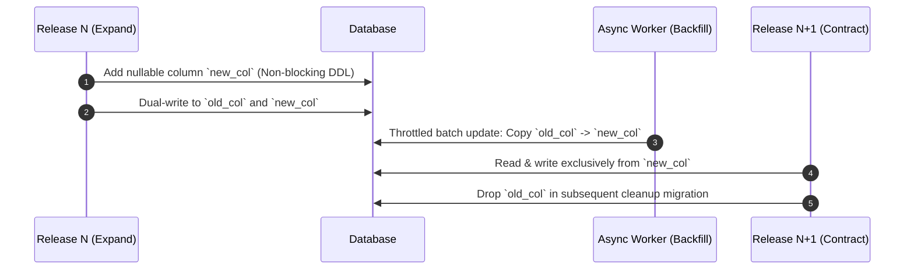

# MIGRATIONS — Database Migration & Zero-Downtime Policies

> **Purpose:** Canonical guidelines for database schema evolution, non-blocking DDL changes, data backfill pipelines, and zero-downtime expand-contract migrations. Tier-3 template — customize for your project.

_Last updated: [DATE]_

---

## 1. Zero-Downtime Expand-Contract Framework

Any database schema mutation that requires taking down the application is strictly prohibited. All schema modifications must follow the 4-phase Expand-Contract pattern across multiple releases.



---

## 2. Non-Blocking DDL Directives (PostgreSQL Specifics)

1. **Lock Timeout Enforcement:** Always set a strict lock timeout before running DDL commands in migration scripts to prevent blocking concurrent application transactions:
   ```sql
   SET lock_timeout = '2s';
   ```
2. **Concurrent Indexing:** Always create indexes using `CONCURRENTLY`. Never run bare `CREATE INDEX` on active production tables:
   ```sql
   CREATE INDEX CONCURRENTLY idx_users_tenant_status ON users (tenant_id, status);
   ```
3. **Adding NOT NULL Columns Safely:**
   - Step 1: Add column as nullable (`ALTER TABLE users ADD COLUMN is_active BOOLEAN;`).
   - Step 2: Add check constraint with `NOT VALID`:
     ```sql
     ALTER TABLE users ADD CONSTRAINT chk_users_is_active CHECK (is_active IS NOT NULL) NOT VALID;
     ```
   - Step 3: Validate constraint asynchronously without holding a full table write lock:
     ```sql
     ALTER TABLE users VALIDATE CONSTRAINT chk_users_is_active;
     ```

---

## 3. Data Backfill Guidelines

- **Batch Size Throttling:** Backfills must run in batches of 500 to 2,000 records, separated by a sleep duration (e.g. 50ms) to allow database replication catch-up and prevent replication lag.
- **Idempotent Updates:** Backfill scripts must be safe to re-run multiple times without producing duplicate data or overwriting concurrent updates.
