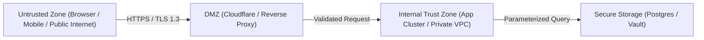

# SECURITY — Security Policies & Threat Mitigation

> **Purpose:** Canonical security baseline, threat modeling boundaries, authentication protocols, secret handling rules, and OWASP Top 10 mitigation strategies. Tier-3 template — customize for your project.

_Last updated: [DATE]_

---

## 1. Threat Boundary & Trust Zones

Architecture must define clear trust zones and assume that external inputs, client devices, and public networks are inherently hostile.



---

## 2. Authentication & Session Management

- **Session Tokens:** Issue cryptographically secure session IDs stored in distributed Redis caches. Return session identifiers in `HttpOnly`, `Secure`, `SameSite=Strict` cookies.
- **JWT Usage Guidelines:** If using stateless JSON Web Tokens, sign tokens using asymmetric keys (`RS256` or `EdDSA`). Store private signing keys in hardware security modules or secure key vaults. Set short lifespans (maximum 15 minutes for access tokens, 7 days for refresh tokens).
- **Password Storage:** Hash user passwords exclusively using Argon2id (`m=65536, t=3, p=4`) or Bcrypt with a work factor of `>= 12`. Never use MD5, SHA-1, or unsalted SHA-256.

---

## 3. OWASP Top 10 Defensive Controls

1. **Injection Prevention:** Raw SQL string concatenation is banned. All queries must execute via parameterized prepared statements.
2. **Broken Object Level Authorization (BOLA):** Every database query retrieving a resource by ID must include a tenant ownership filter (e.g. `WHERE id = :id AND tenant_id = :currentTenantId`).
3. **Cross-Site Scripting (XSS):** Rely on framework auto-escaping. Set Content Security Policy (CSP) headers disallowing inline scripts (`script-src 'self'`).
4. **Cross-Site Request Forgery (CSRF):** Verify double-submit CSRF tokens or custom request headers (`X-Requested-With`) on all state-mutating requests (`POST`, `PUT`, `DELETE`).

---

## 4. Secrets Management & Logging Hygiene

- **Zero Hardcoded Secrets:** Never commit passwords, private keys, database connection strings, or third-party API credentials into git repositories.
- **Secret Scanning in CI:** Enforce automated pre-commit hooks and CI scans using tools like Gitleaks or Trufflehog to detect credential leakage.
- **Sanitized Logging:** Strip sensitive personal identifiable information (PII), bearer tokens, authorization headers, and credit card numbers from stdout logs before formatting.

```typescript
// Example: Redaction utility for structured logging
export function sanitizeLogPayload(
  payload: Record<string, unknown>,
): Record<string, unknown> {
  const SENSITIVE_KEYS = new Set([
    "password",
    "token",
    "authorization",
    "secret",
    "apiKey",
  ]);
  const clean: Record<string, unknown> = {};

  for (const [key, value] of Object.entries(payload)) {
    if (SENSITIVE_KEYS.has(key.toLowerCase())) {
      clean[key] = "[REDACTED]";
    } else {
      clean[key] = value;
    }
  }
  return clean;
}
```
