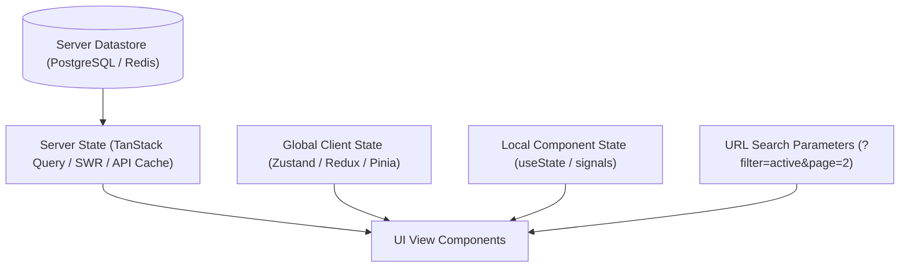

# STATE — State Management & Data Flow Architecture

> **Purpose:** Canonical specification for server state caching, client-side state boundaries, optimistic mutations, and real-time synchronization. Tier-3 template — customize for your project.

_Last updated: [DATE]_

---

## 1. State Categorization & Ownership Boundaries

To eliminate out-of-sync data bugs and memory leaks, state must be partitioned into four distinct categories:

1. **Server State:** Asynchronous data originating from database queries or remote APIs. Owned and managed via dedicated query cache libraries (e.g. TanStack Query). Never duplicate server state into global client stores.
2. **Global Client State:** Ephemeral state shared across disparate UI trees (e.g. theme preference, active modal toggles, sidebar collapse state). Managed via minimal stores (e.g. Zustand).
3. **Local Component State:** Transient UI state localized to a single component (e.g. form input draft, dropdown open state). Managed with native hooks/signals.
4. **URL State:** Filter criteria, search queries, active tab IDs, and pagination cursors must reside in URL query parameters to ensure bookmarkability and browser navigation support.

---

## 2. Server State Caching & Invalidation Rules

- **Cache Keys:** Use deterministic array keys formatted as tuples (e.g. `['projects', tenantId, { status: 'active' }]`).
- **Stale-While-Revalidate:** Configure default stale times (e.g. `staleTime: 1000 * 60 * 5` for 5 minutes) to avoid redundant network queries on window focus.
- **Optimistic UI Updates:** Apply optimistic updates for simple state mutations (e.g. toggling a favorite icon). The UI must snapshot previous state, apply the update immediately, and roll back cleanly if the server rejects the mutation.

---

## 3. Real-Time Synchronization & Conflict Resolution

- **WebSocket / SSE Invalidation:** When receiving real-time pub/sub events over WebSockets, the client should invalidate matching query cache keys rather than manually patching complex nested arrays in memory.
- **Last-Write-Wins with Timestamps:** Entity models must maintain a `version` integer or monotonic timestamp to detect concurrent edit collisions (Optimistic Concurrency Control).
