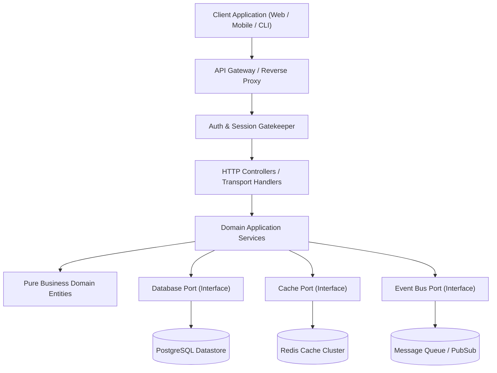
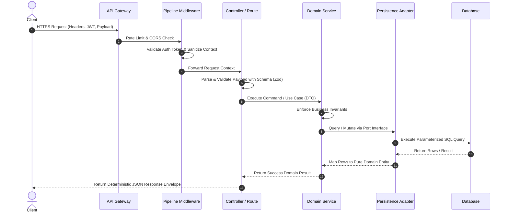

# ARCHITECTURE — Technical Architecture & Component Boundaries

> **Purpose:** Document high-level system topology, service boundaries, technology stack selections, data flow lifecycles, and cross-cutting architectural invariants so engineering decisions preserve system integrity. Tier-3 template — fill it in for your project.

_Last updated: [DATE]_

---

## 1. High-Level System Overview & Topology

[PLACEHOLDER: Provide a high-level summary of system topology, architectural pattern (e.g. Hexagonal, Clean Architecture, Modular Monolith), primary communication protocols, and runtime deployment targets.]



---

## 2. Technology Stack & Decision Matrix

Document all approved core technologies and explicit technical trade-off rationale.

| Layer / Concern         | Chosen Technology                                | Evaluated Alternatives           | Rationale & Trade-off Consideration                                                             |
| :---------------------- | :----------------------------------------------- | :------------------------------- | :---------------------------------------------------------------------------------------------- |
| **Language**            | `[PLACEHOLDER: TypeScript 7+ / Go / Python]`     | `[PLACEHOLDER: Alternative]`     | Strict static typing, ecosystem maturity, and shared contracts between frontend and backend.    |
| **Framework / Runtime** | `[PLACEHOLDER: Node.js ESM / Next.js / FastAPI]` | `[PLACEHOLDER: Alternative]`     | Minimal cold-start overhead, streaming response support, and robust standard library.           |
| **Primary Datastore**   | `[PLACEHOLDER: PostgreSQL 16+]`                  | `[PLACEHOLDER: MySQL / MongoDB]` | Proven ACID guarantees, robust indexing (GIN, BRIN), and native JSONB querying capabilities.    |
| **ORM / Query Builder** | `[PLACEHOLDER: Drizzle ORM / Prisma / SQLx]`     | `[PLACEHOLDER: Raw SQL]`         | Type-safe query derivation with zero magic abstraction and explicit control over generated SQL. |
| **Cache Layer**         | `[PLACEHOLDER: Redis 7+ / Dragonfly]`            | `[PLACEHOLDER: Memcached]`       | In-memory atomic data structures, Pub/Sub clustering, and flexible eviction algorithms.         |

---

## 3. Directory Layout & Module Isolation

Strict file organization enforcing inward-pointing dependency rules and domain segregation.

```text
src/
├── app/                     # Transport layer & framework routing entrypoints
├── domains/                 # Isolated domain business logic modules
│   ├── auth/                # Feature domain: authentication & authorization
│   │   ├── entities/        # Pure domain models (zero framework imports)
│   │   ├── services/        # Use cases & workflow orchestration
│   │   ├── ports/           # Outbound interfaces (repositories, mailers)
│   │   └── dtos/            # Validated boundary data transfer objects
│   └── billing/             # Feature domain: invoices & subscription lifecycle
├── infrastructure/          # Outbound adapters implementing domain ports
│   ├── persistence/         # Database repositories (Drizzle/PostgreSQL)
│   ├── cache/               # Redis cache-aside client implementations
│   └── integrations/        # Third-party SDK wrappers & external API clients
└── shared/                  # Cross-cutting primitives (logging, errors, branded types)
```

### Module Boundary Rules

1. **Inward Dependency Rule:** Outer transport layers and infrastructure adapters depend on domain contracts. Domain core entities never import from outer infrastructure or web frameworks.
2. **Sibling Domain Isolation:** Feature domains (`domains/auth`, `domains/billing`) must not import internal private classes from each other. Cross-domain interactions route via explicit public service interfaces or asynchronous domain events.
3. **Prohibition of Barrel Files:** Never author or import from `index.ts` re-export files. Always use direct, explicit imports to ensure fast module resolution and precise tree-shaking.

---

## 4. Cross-Cutting Pipelines & Request Flow

Standardized lifecycle for incoming requests, data mutations, and outgoing responses.



---

## 5. Architectural Invariants & Anti-Pattern Defense

Non-negotiable architectural boundaries preventing systemic decay over time.

- **Fail-Closed Boundaries:** Malformed requests or untyped payloads must be rejected immediately at the perimeter (HTTP 400).
- **Stateless Application Tier:** Application services must maintain zero sticky state in local memory. All session state resides in distributed caches or databases.
- **Zero Global Singletons:** Shared services and database connections must be injected via constructors or application context, never accessed via global mutable singletons.
- **Circuit Breakers on External APIs:** Outbound HTTP integrations must be wrapped in timeout, retry, and circuit breaker policies to prevent cascading service degradation.
