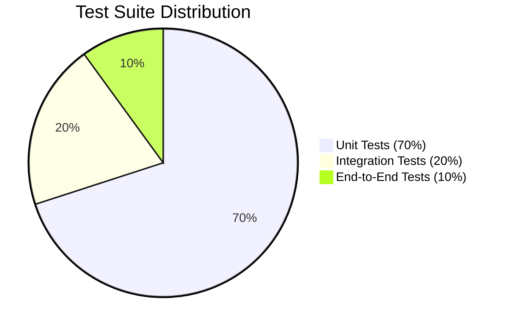

# TESTING — Testing Strategy & Quality Pyramid

> **Purpose:** Canonical testing strategy, test pyramid distribution, mocking boundaries, fixture standards, and coverage metrics to ensure deterministic code correctness and eliminate regressions. Tier-3 template — customize for your project.

_Last updated: [DATE]_

---

## 1. Testing Pyramid & Target Distribution

Every codebase must balance test execution speed, deterministic reliability, and production realism according to the 70/20/10 testing pyramid.



1. **Unit Tests (70%):** Fast, isolated, in-memory tests verifying pure domain business rules, utility functions, and entity state transitions. Zero network, database, or filesystem IO. Must execute in `< 10ms` per test file.
2. **Integration Tests (20%):** Verify module interactions, database repository queries, caching pipelines, and API HTTP routes against real local containers (e.g. Testcontainers or local PostgreSQL).
3. **End-to-End Tests (10%):** Browser-driven journey tests (Playwright) verifying critical customer conversion flows, authentication handoffs, and payment checkouts.

---

## 2. Test Execution & Naming Conventions

- **File Naming:** Place unit tests alongside the source code using `.test.ts` or `.spec.ts` suffixes (e.g. `auth-service.ts` -> `auth-service.test.ts`). Place E2E tests in a dedicated `tests/e2e/` directory.
- **Structure (AAA Pattern):** Every test block must structure logic using **Arrange, Act, Assert**:

```typescript
import { test, describe } from "node:test";
import assert from "node:assert/strict";

describe("PricingCalculator", () => {
  test("applies 20 percent volume discount when quantity exceeds 100 units", () => {
    // Arrange
    const basePrice = 1000; // in cents
    const quantity = 150;
    const calculator = new PricingCalculator();

    // Act
    const total = calculator.calculateTotal(basePrice, quantity);

    // Assert
    assert.strictEqual(total, 120_000);
  });
});
```

---

## 3. Mocking Boundaries & Anti-Mock Directives

1. **Never Mock What You Own in Integration Tests:** When testing repository or database adapters, execute queries against a real local database instance rather than mocking the query builder.
2. **Mock Third-Party Boundary APIs:** Mock third-party external services (e.g. Stripe, Twilio, SendGrid) using network-level interceptors (e.g. MSW - Mock Service Worker) rather than monkey-patching SDK instances.
3. **Deterministic Clock & Time:** Inject clock abstractions (`ClockProvider`) into domain services rather than relying on system `Date.now()`, enabling deterministic time-travel assertions for token expiration and cron schedules.

---

## 4. Flaky Test Mitigation & CI Verification Gates

- **Zero-Tolerance for Flakiness:** Tests relying on arbitrary sleep durations (`await sleep(500)`) are strictly banned. Always await deterministic events, state promises, or DOM visibility locators.
- **Coverage Thresholds:** Minimum 80% branch coverage on core domain services. 100% coverage on financial billing calculations and permission access controls.
- **CI Test Suite Budget:** The full unit and integration test suite must execute in under 3 minutes on standard CI runners.
